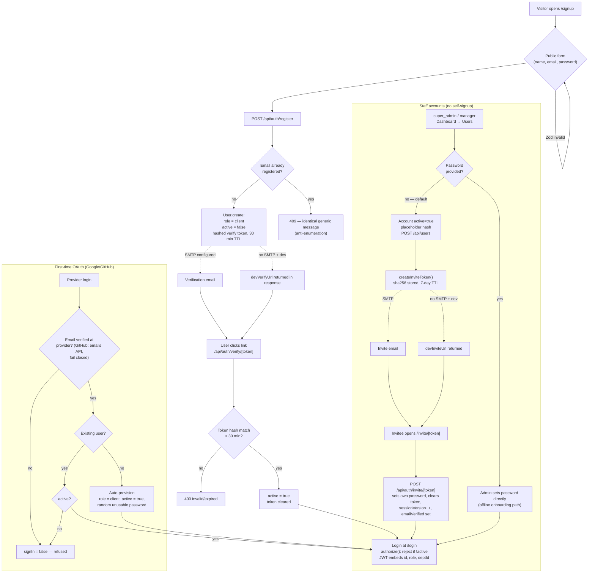
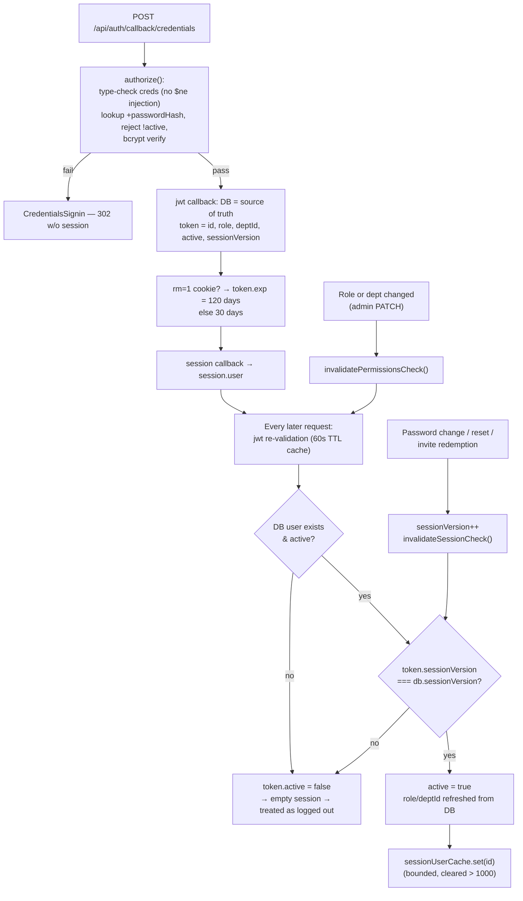
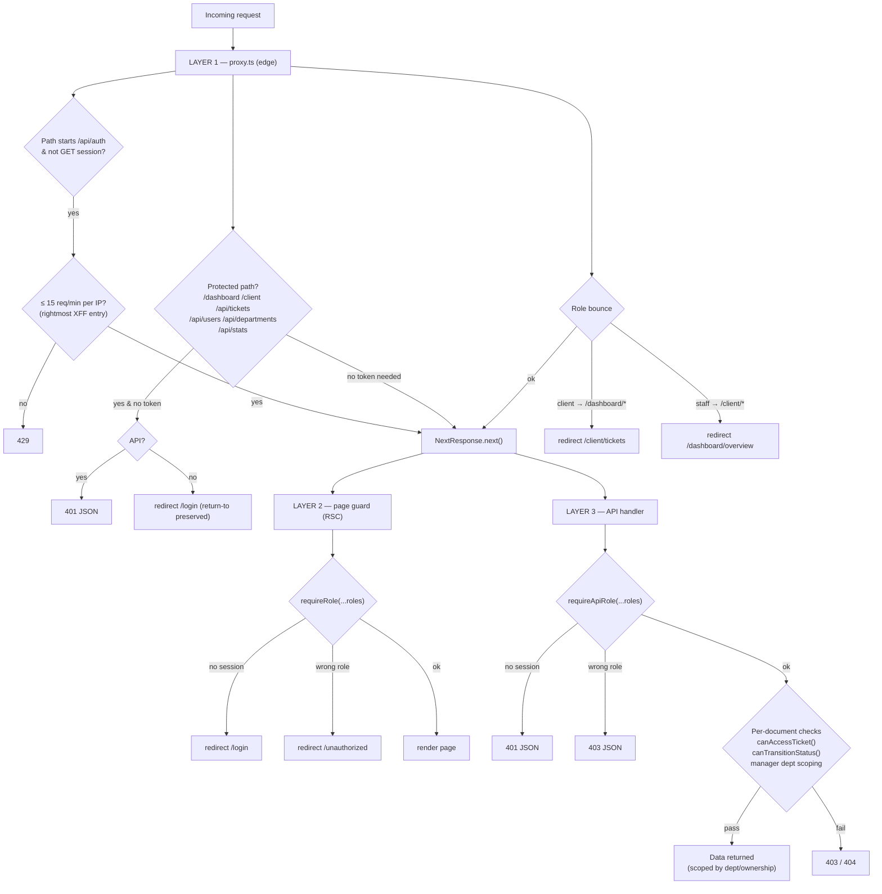
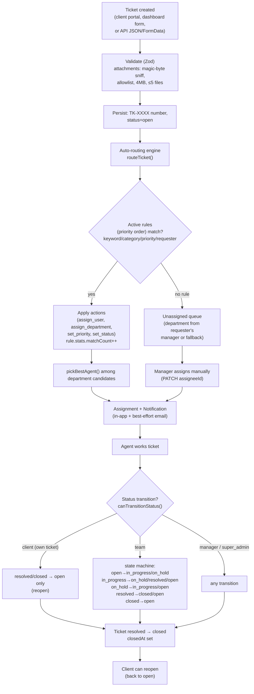
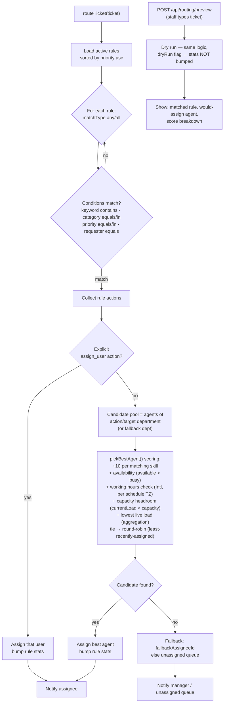
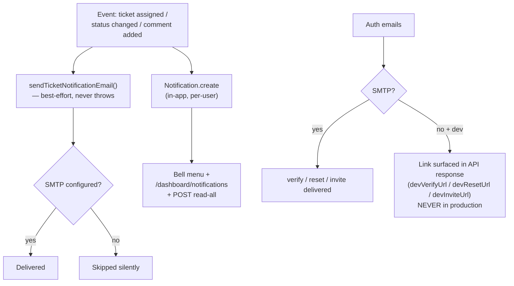
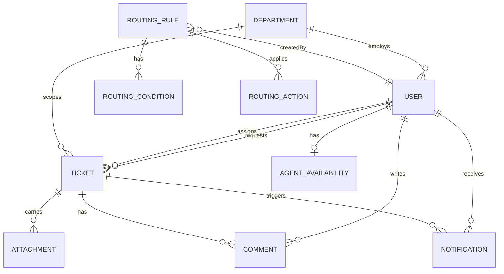
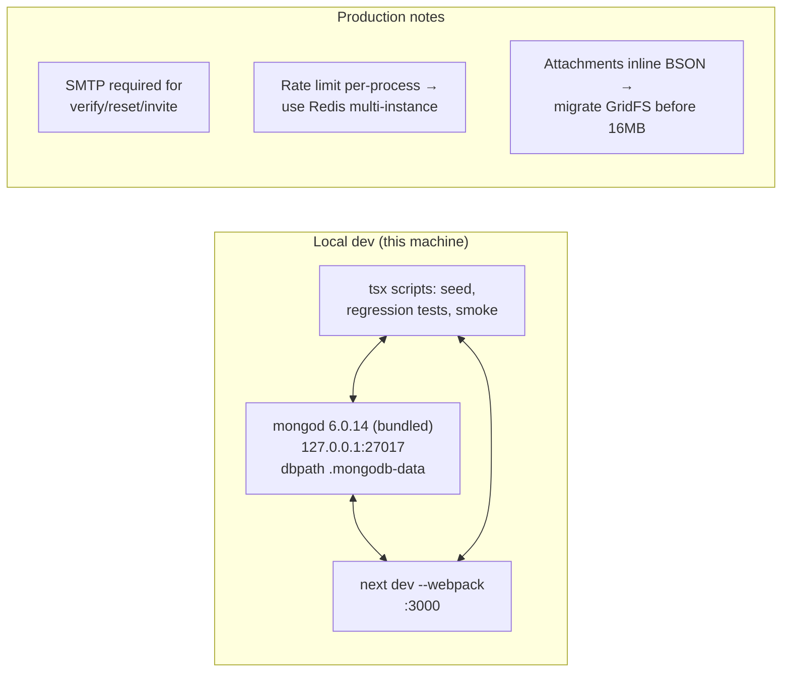

# TicketFlow — Full System Workflow

End-to-end flowcharts of the current system. Render in any Mermaid-compatible viewer (GitHub, VS Code, Obsidian).

- **Stack:** Next.js 16 (App Router) · React 19 · MongoDB/Mongoose · NextAuth v5 (JWT sessions) · Zod
- **Roles:** `super_admin` · `manager` · `team` · `client`
- **Legend:** rectangles = actions/states · diamonds = decisions · dashed arrows = email side effects / dev fallbacks

---

## 1. Bird's-eye view (ASCII)

```
                          ┌──────────────────────────────────────────┐
                          │                 CLIENTS                  │
                          │  signup → verify email → /client portal  │
                          └───────────────┬──────────────────────────┘
                                          │ create ticket
                                          ▼
   ADMIN creates staff ┐        ┌──────────────────┐
   (or emails invite)  ├──────► │ ROUTING ENGINE   │──► best agent chosen
                          │        │ (rules + scoring) │    (skills, load,
                          │        └────────┬─────────┘     hours, round-robin)
                          │                 │ assign + notify
                          ▼                 ▼
                 ┌─────────────────────────────────┐
                 │  AGENTS (team) & MANAGERS       │
                 │  /dashboard: queue, tickets,    │
                 │  workload, analytics, rules     │
                 └─────────────────────────────────┘
```

---

## 2. Account creation & role determination



---

## 3. Login & session lifecycle



---

## 4. Request authorization — 3 layers



Page guard map:

| Page | requireRole |
|---|---|
| overview, tickets, tickets/new, tickets/[id], notifications | super_admin, manager, team |
| analytics, workload, queue, departments, users, routing | super_admin, manager |

API role map (write endpoints):

| Endpoint | requireApiRole |
|---|---|
| POST/PATCH/DELETE users | super_admin (manager limited, see §2) |
| DELETE departments | super_admin |
| routing rules CRUD, preview | super_admin, manager |
| routing agents | super_admin, manager, team |
| tickets, comments, attachments, notifications | all four roles + per-document checks |

---

## 5. Ticket lifecycle



---

## 6. Auto-routing engine detail



---

## 7. Notifications & email



---

## 8. Data model (relations)



---

## 9. Environments & operations



---

## 10. Where to look (code index)

| Concern | File |
|---|---|
| Auth config, session re-validation | `src/lib/auth.ts` |
| requireRole / requireApiRole / canAccessTicket / canTransitionStatus | `src/lib/authz.ts` |
| Edge middleware, rate limiting | `src/proxy.ts` |
| Register / verify / reset / invite endpoints | `src/app/api/auth/**` |
| Invite tokens | removed 2026-09-30 (invite-link flow deleted; credential email only) |
| User CRUD (create policy + edit ticketAccess/reportingManager) | `src/app/api/users/**` |
| Tickets, comments, attachments | `src/app/api/tickets/**` |
| Routing engine | `src/lib/routing/engine.ts` |
| Rule scope | `src/lib/routing/ruleScope.ts` |
| Models | `src/lib/db/models.ts` |
| Seed | `src/lib/db/seed.ts`, `npm run seed` |
| Tests | `npm test` (typecheck + 5 regression suites, 92 assertions incl. the runtime core), `scripts/api-smoke.js` (55), `scripts/transfer-smoke.js` (26), `scripts/page-render-smoke.js` (6 pages), `scripts/invite-smoke.js` (24 — credential-email user-creation policy, kept the filename for history) |
